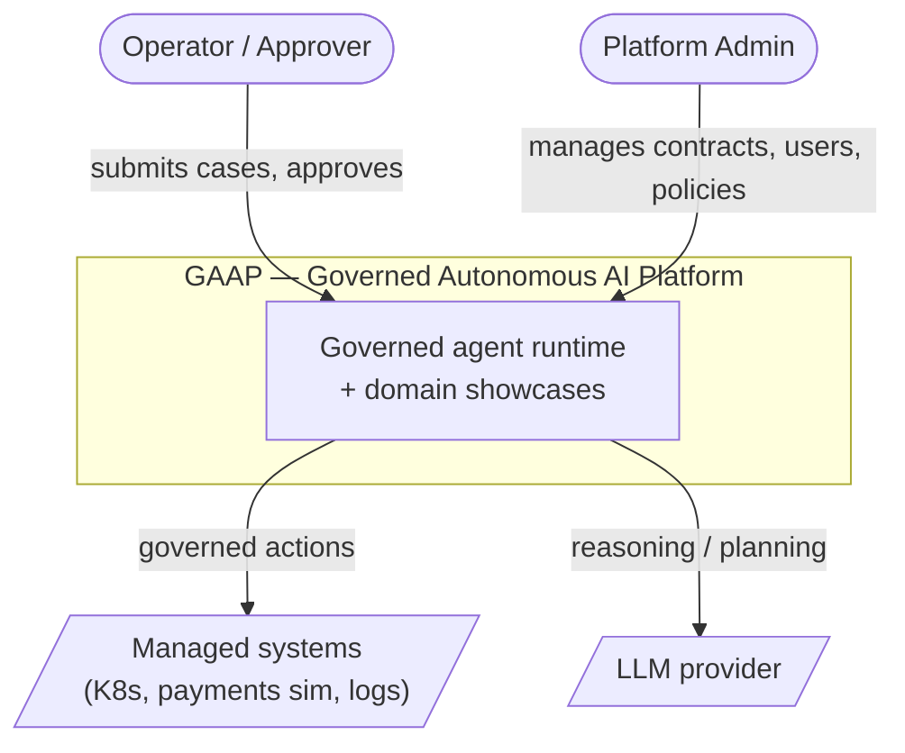
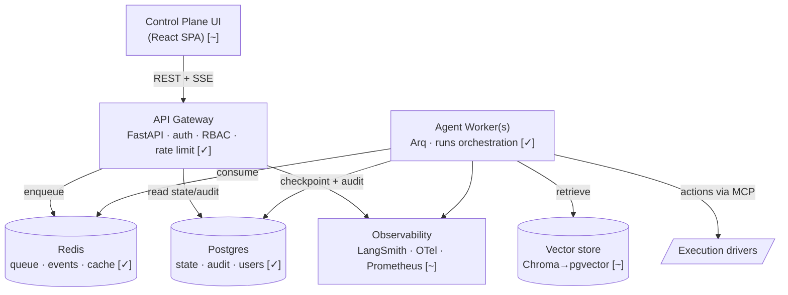
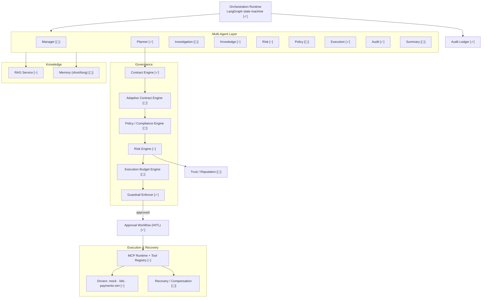
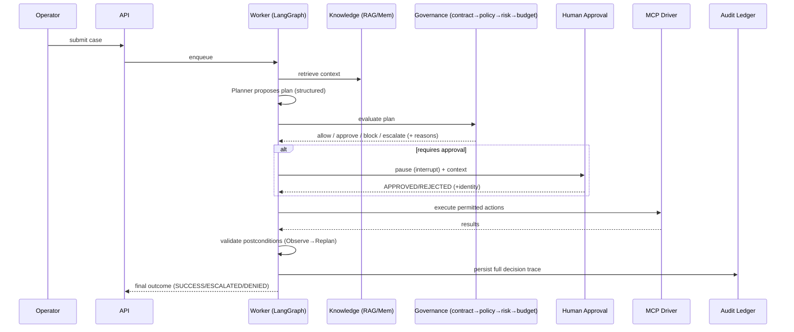
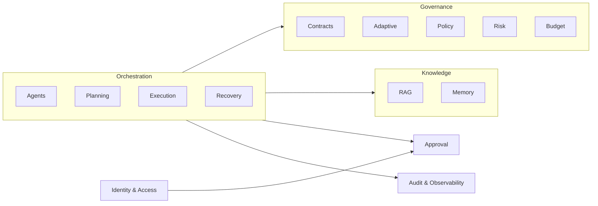

# 02 — Architecture

> **Author:** Santhosh Kumar Nalla | [LinkedIn](https://linkedin.com/in/techiesanthoshnalla)

Diagrams use Mermaid (renders on GitHub). Legend: **[✓ built]** exists today, **[~ partial]**, **[▢ planned]**.

## 1. C4 — Level 1: System Context



## 2. C4 — Level 2: Containers



## 3. C4 — Level 3: Components of the Agent Worker (the platform core)



## 4. Key sequence — governed action lifecycle



## 5. Bounded contexts (DDD)



Each context owns its models and exposes an interface; the **Orchestration** context composes them. Domains (payments, infra) live **outside** core and depend only on interfaces.

## 6. Target repository structure

```
gaap/
├── core/                     # reusable, domain-agnostic platform
│   ├── orchestration/        # LangGraph runtime, state, routing [✓ from current app]
│   ├── contracts/            # contract engine + loader [✓]  + adaptive engine [▢]
│   ├── policy/               # policy/compliance packs (PCI/GDPR/SOX) [▢]
│   ├── risk/                 # scoring model + decision matrix [~]
│   ├── budget/               # token/cost/time/call budgets [▢]
│   ├── guardrails/           # deterministic enforcement [✓]
│   ├── agents/               # agent runtime + multi-agent roles [~]
│   ├── execution/            # MCP runtime, tool registry, drivers, compensation [~]
│   ├── knowledge/            # RAG + memory [~]
│   ├── approval/             # HITL workflow [✓]
│   ├── audit/                # audit ledger [✓]
│   ├── trust/                # reputation model [▢]
│   ├── observability/        # LangSmith + OTel + metrics [~]
│   ├── events/               # event bus (Redis Streams) [✓]
│   └── identity/             # auth + RBAC [✓]
├── examples/
│   ├── incident-commander/   # infra/K8s showcase [✓ exists today]
│   └── payments-ops/         # FLAGSHIP: Payment Incident Commander [▢]
├── apps/
│   ├── api/                  # FastAPI gateway [✓]
│   ├── worker/               # Arq worker [✓]
│   └── ui/                   # control plane [~]
├── deploy/                   # docker-compose [✓], Terraform [▢], k8s manifests [▢], CI [▢]
└── docs/                     # these design docs [✓]
```

## 7. Technology decisions (and deviations from the vision doc)
| Area | Choice | Note |
|---|---|---|
| Orchestration | LangGraph | matches doc |
| Queue | **Arq** (Redis) | doc said Celery; Arq is async-native, lighter — equivalent role |
| Events | **Redis Streams** | doc said Kafka; Streams fits current scale, Kafka is a later swap behind the `events` interface |
| Vector store | Chroma → **pgvector** | migrate to pgvector to consolidate on Postgres (doc's choice) |
| Tracing | LangSmith + **OpenTelemetry** | OTel to be added (currently Prometheus only) |
| Frontend | **React/TS/Vanilla CSS** target | SPA served by FastAPI today; React Vite is the production target |
| Deploy | docker-compose → **Terraform + k8s + GitHub Actions** | local now; IaC + CI planned |

All deviations sit behind interfaces so they can be swapped without touching domain code.
